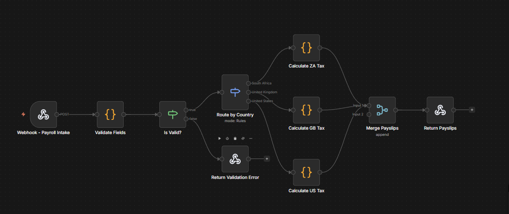
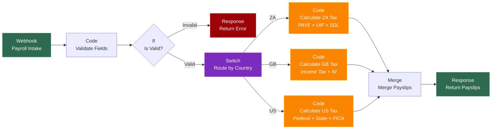

<p align="center">
  
</p>

<h1 align="center">Dedukto</h1>

<p align="center">
  <strong>Open-source multi-country payroll engine with real tax calculations.</strong><br>
  Gross-to-net across South Africa, United Kingdom, and United States — with an MCP server for AI agent integration.
</p>

<p align="center">
  <a href="https://justkelly-sys.github.io/Dedukto/">Live Demo</a> · 
  <a href="#mcp-server">MCP Server</a> · 
  <a href="#supported-jurisdictions">Jurisdictions</a> · 
  <a href="#quick-start">Quick Start</a> · 
  <a href="#architecture">Architecture</a>
</p>

---

## Overview

Dedukto is a precision-engineered payroll calculation engine that handles statutory deductions across three major tax jurisdictions. It ships with:

- **Interactive Frontend** — Liquid-glass UI with live payroll processing, PDF payslips, and compliance reports
- **MCP Server** — Model Context Protocol server exposing payroll calculations as AI-callable tools
- **n8n Workflow** — Visual automation workflow for batch payroll processing

**Built for transparency.** Every tax bracket, rebate, and threshold is implemented in auditable code with source comments referencing official SARS, HMRC, and IRS documentation.

### Key Features

- **Real Tax Calculations** — Current 2024/2025 brackets from official government sources
- **3 Jurisdictions** — South Africa (PAYE, UIF, SDL), United Kingdom (Income Tax, NI, Pension), United States (Federal, State, FICA, 401(k))
- **MCP Server** — 3 tools (`calculate_paye`, `calculate_net_pay`, `list_tax_brackets`) callable by any MCP-compatible AI agent
- **Interactive Frontend** — Purple liquid-glass UI with live payroll processing, master-detail payslips, and PDF export
- **Compliance Report** — Aggregated multi-country summary with per-jurisdiction breakdowns
- **52+ Tests** — 31 JS unit tests + 21 Python tests covering all tax calculations and MCP tools

---

## MCP Server

Dedukto exposes SARS 2024/25 payroll calculations as **Model Context Protocol (MCP)** tools — callable by Claude Desktop, LangGraph agents, or any MCP-compatible client.

### Tools

| Tool | Input | Output |
|---|---|---|
| `calculate_paye` | annual gross, jurisdiction, age | Full PAYE/UIF/SDL breakdown + net pay |
| `calculate_net_pay` | monthly gross, jurisdiction, age | Monthly net take-home |
| `list_tax_brackets` | jurisdiction | All 7 SARS 2024/25 brackets + rebate |

### Quick Start (MCP)

```bash
# Run as standalone MCP server
python -m mcp_server.server

# Or use directly as a Python library
python -c "from mcp_server.tax_engine import calculate_paye_za; print(calculate_paye_za(600_000))"
```

### Example

```python
from mcp_server.tax_engine import calculate_paye_za

result = calculate_paye_za(annual_gross=600_000)
print(f"PAYE/month:  R{result.paye_monthly:,.2f}")    # R11,136.42
print(f"UIF/month:   R{result.uif_monthly:,.2f}")     # R177.12
print(f"Net/month:   R{result.net_monthly:,.2f}")      # R38,686.46
print(f"Effective %: {result.effective_rate_pct}%")     # 22.27%
```

### MCP Tool Call (JSON)

```json
{
  "tool": "calculate_paye",
  "arguments": {
    "gross_income": 600000,
    "jurisdiction": "ZA",
    "age": 30
  }
}
```

### Input Validation

- `annual_gross < 0` → `ValueError`
- `age <= 0 or age > 120` → `ValueError`
- Unsupported jurisdiction → `ValueError` (ZA currently supported via MCP)

### Integration with LexFlow

The MCP server integrates with [LexFlow](https://github.com/JustKelly-sys/LexFlow) as Layer 5 (System Integration) of the AI Ops Suite. When the LangGraph billing pipeline detects payroll-related matters, it calls the Dedukto tax engine to enrich billing entries with PAYE/Net breakdowns.

---

## Live Demo

**[→ Try the live demo](https://justkelly-sys.github.io/Dedukto/)**

The demo includes 9 pre-loaded sample employees across ZA, GB, and US. Click **Run Payroll** to process all employees and generate payslips with real tax calculations.

### Demo Features

| Feature | Description |
|---------|-------------|
| **Payroll Workspace** | Employee grid with country badges, salary display, add/edit/delete |
| **Live Processing** | One-click payroll run with animated progress |
| **Master-Detail Payslips** | Sidebar navigation with full earnings/deductions breakdown |
| **PDF Export** | Download individual payslips as formatted PDFs with company branding |
| **Compliance Report** | Summary stats + per-country aggregation (gross, deductions, net, employer cost) |
| **Jurisdiction Browser** | Deep-dive into each country's tax logic with bracket tables |

---

## Supported Jurisdictions

### South Africa (2024/2025 Tax Year)

| Component | Rate |
|-----------|------|
| **PAYE** | Progressive 18% to 45% (7 brackets) |
| **UIF** | 1% employee + 1% employer (capped R17,712/mo) |
| **SDL** | 1% employer levy |
| **Medical Aid Credits** | R364/mo main member + dependents |
| **Retirement Fund** | Deductible up to 27.5% (R350k annual cap) |

### United Kingdom (2025/2026 Tax Year)

| Component | Rate |
|-----------|------|
| **Income Tax** | 20% basic / 40% higher / 45% additional |
| **National Insurance** | 8% employee, 2% above; 15% employer |
| **Student Loan** | Plans 1, 2, 4, 5 + Postgraduate |
| **Workplace Pension** | 5% employee + 3% employer (auto-enrolment) |

### United States (2025 Tax Year)

| Component | Rate |
|-----------|------|
| **Federal Income Tax** | 10% to 37% (7 brackets), Single + MFJ |
| **Social Security** | 6.2% employee + employer (capped $176,100) |
| **Medicare** | 1.45% + 0.9% Additional above $200k |
| **State Tax** | TX (0%), CA (up to 13.3%), NY (up to 10.9%) |
| **401(k)** | Pre-tax, $23,500 limit + SECURE 2.0 catch-up |

---

## Quick Start

### Run the Frontend Demo (No Backend Required)

```bash
git clone https://github.com/JustKelly-sys/Dedukto.git
cd Dedukto
npx serve frontend -l 3000
```

Open `http://localhost:3000` — all tax calculations run client-side.

### Run with n8n (Full Workflow)

```bash
# 1. Start n8n
npx n8n

# 2. Import workflow via n8n UI
#    Workflows > Import from File > workflows/global-payroll-processor.json

# 3. Trigger via webhook
curl -X POST http://localhost:5678/webhook/payroll-run \
  -H "Content-Type: application/json" \
  -d @sample-data/employees.json
```

### Run Tests

```bash
# JS unit tests (31 tests)
npm test

# Python MCP tests (21 tests)
pip install pytest mcp
python -m pytest tests/ -v
```

---

## Architecture

```
Dedukto/
├── frontend/                    # Interactive UI (vanilla HTML/CSS/JS)
│   ├── index.html               # Single-page app shell
│   ├── style.css                # Tectonic Ledger design system
│   ├── app.js                   # Tax engine + UI + PDF generation
│   └── logo.png                 # Brand mark
├── mcp_server/                  # Python MCP server (NEW)
│   ├── server.py                # FastMCP server — 3 tools
│   ├── tax_engine.py            # SARS 2024/25 PAYE/UIF/SDL pure functions
│   └── __init__.py
├── tax-logic/                   # JavaScript tax engines
│   ├── index.js                 # Unified entry (route by country)
│   ├── south-africa.js          # SARS PAYE + UIF + SDL + credits
│   ├── united-kingdom.js        # HMRC Income Tax + NI + pension
│   ├── united-states.js         # IRS Federal + State + FICA + 401(k)
│   └── test-calculations.js     # 31 unit tests
├── tests/                       # Python tests
│   ├── test_tax_engine.py       # 13 unit tests
│   └── test_mcp_server.py       # 8 integration tests
├── workflows/
│   └── global-payroll-processor.json   # n8n workflow
├── sample-data/
│   └── employees.json           # 9 employees (3 per country)
└── README.md
```

### Data Flow

```
Employee Data → Validate → Route by Country → Calculate Tax → Payslip
                                 │
                  ┌──────────────┼──────────────┐
                  │              │              │
               ZA: PAYE       GB: Income     US: Federal
                  UIF           Tax              State
                  SDL           NI               FICA
                  Medical       Pension          401(k)
                  Retirement    Student Loan
```

---


## n8n Workflow

Dedukto's backend is a visual n8n automation workflow. Here's what it looks like:

<p align="center">
  
</p>

> **Recruiters:** You don't need to install anything to view this. The workflow JSON is in [`workflows/global-payroll-processor.json`](workflows/global-payroll-processor.json) and can be imported into any [n8n instance](https://n8n.io) or viewed directly on GitHub.

### Workflow Flow (Mermaid)



---

## Why Dedukto?

| | Enterprise Payroll | Dedukto |
|---|---|---|
| **Cost** | $12-99/employee/month | Free and open-source |
| **Self-hostable** | No (cloud SaaS) | Yes (npx n8n) |
| **Tax logic** | Black box | Transparent, commented JS + Python |
| **AI integration** | None | MCP tools for any AI agent |
| **Multi-country** | Behind subscription | Open and auditable |
| **Customizable** | Limited | Fork any calculation |

---

## Design System

The frontend implements the **Tectonic Ledger** design system:

- **Palette** — Obsidian dark (#0e0e10) with lavender accents (#947dff, #cabeff)
- **Typography** — DM Sans (body) + Space Grotesk (headlines) via Google Fonts
- **Surface Treatment** — Purple liquid-glass (rgba purple tint + backdrop-filter blur)
- **Components** — Glassmorphic cards, SVG flag icons, professional silhouette avatars
- **Background** — Topology contour map with scroll-triggered blur effect

---

## Updating Tax Rates

When a new tax year begins, update the constants at the top of each file:

| File | What to Update |
|------|---------------|
| `tax-logic/south-africa.js` | PAYE brackets, rebates, UIF cap, medical credits |
| `tax-logic/united-kingdom.js` | Income tax bands, NI thresholds, student loan thresholds |
| `tax-logic/united-states.js` | Federal brackets, standard deduction, SS wage cap, state brackets |
| `mcp_server/tax_engine.py` | PAYE brackets, rebates, UIF ceiling (Python MCP) |

Run `npm test` and `python -m pytest tests/ -v` after to verify calculations.

---

## License

MIT

## Author

**Tshepiso Jafta** — [LinkedIn](https://www.linkedin.com/in/tshepisojafta/)
